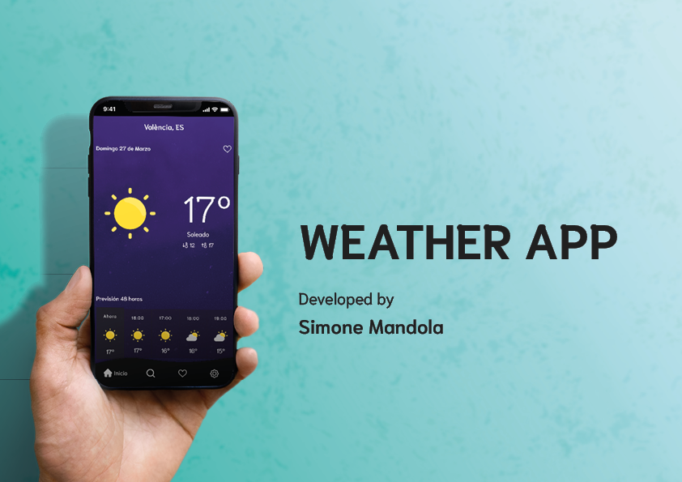
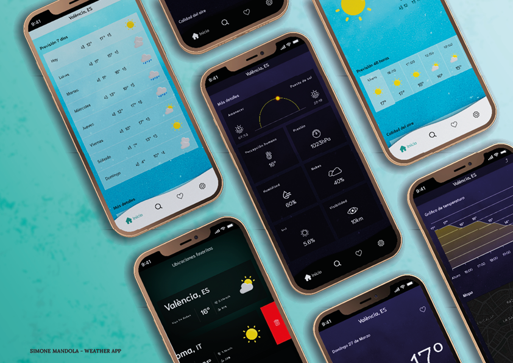

# app-weather with Vue 3 Option API + Vuex

Link: [See live mode](https://simone-mandola-app-weather.netlify.app)

Weather app developed with:

- Vue.js
- SASS
- npm packages
- gulp
- apexcharts
- vue3 touch events
- supabase
- netlify

### Others software

- Photoshop
- Illustrator
- InDesign

### APIs

- [Open weather](https://openweathermap.org/)
- [Mapbox](https://www.mapbox.com/)
- [Geoapify Location Platform API](https://apidocs.geoapify.com/)

## Illustrations
Illustration by [Olha Khomich](https://icons8.com/illustrations/author/CkHJmwURlxnt) from [Ouch](https://icons8.com/illustrations)!
